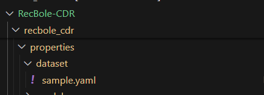
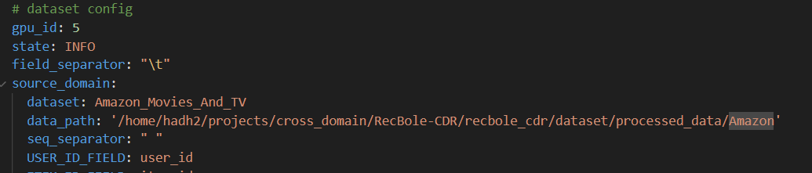
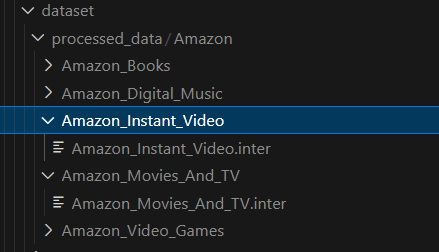
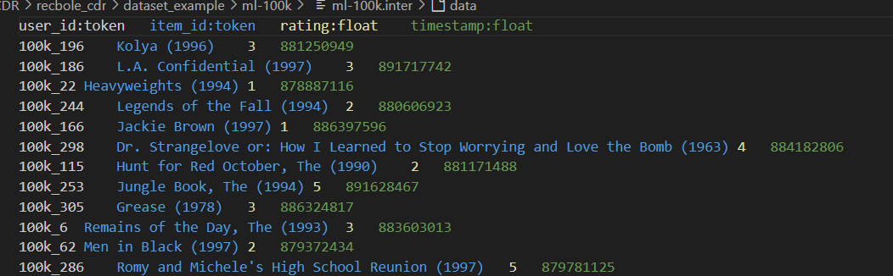
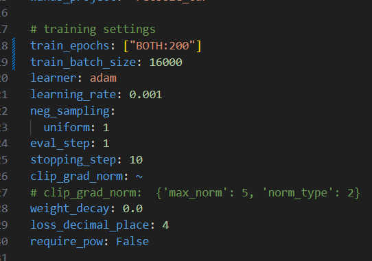

### Chọn dataset
Chọn source domain và target_domain trong file recbold_cdr/properties/dataset/sample.yaml

Đặt đường dẫn tới thư mục chứa các thư mục dataset ở trường data_path, như trong hình dưới là thư mục Amazon, chứa các thư mục dataset, bên trong mỗi thư mục dataset đó chỉ chứa 1 file đuôi .inter. Chị hãy tạo một thư mục TV360 giống với Amazon và thay đường dẫn tới nó vào trường data_path trong file sample.yaml, thay tên thư mục dataset vào trường dataset. Làm tương tự với cả source domain và target domain

Dữ liệu TV360 đang ở trong thư mục CDRIB/dataset/raw_data, có tên là movie.csv và video.csv. Chị hãy chuyển trường watch_duration thành 5 hết hoặc chị có cách nào map nó về rating từ 1 đến 5 cũng được, sau đó đổi tên các cột sao cho giống với file .inter mẫu trên, sau đó lưu ra file text đuôi .inter bằng pd.to_csv với delimeter là dấu tab.

### Chọn tham số mô hình
Các file tham số mô hình nằm trong folder recbole_cdr/properties/model/. 

### Chọn tham số train
Các tham số train ở trong file overall.yaml, gpu_id trong file này và file sample.yaml phải giống nhau. 

Một số mô hình có thể ghi đè các tham số train ở trong file config của nó, ví dụ như epochs, chị hãy để ý.

### Chạy mô hình
Cd tới thư mục RecBold-CDR và chạy file run.py với arg --model là tên các model (BiTGCF, SSCDR, ...)